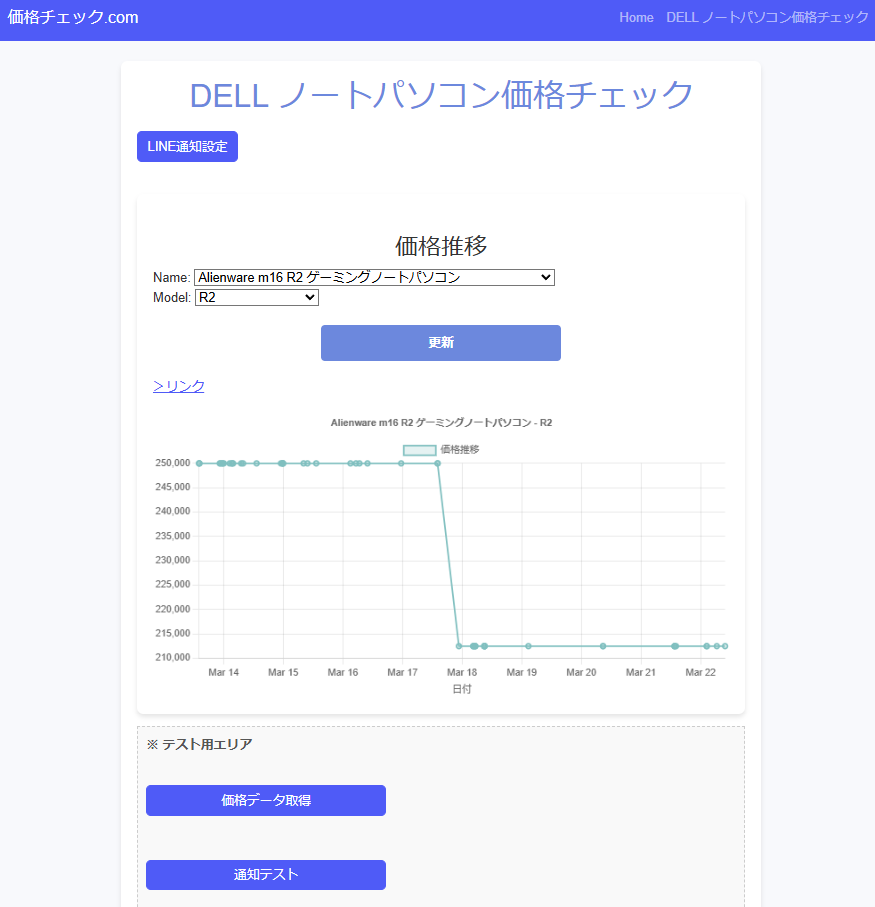
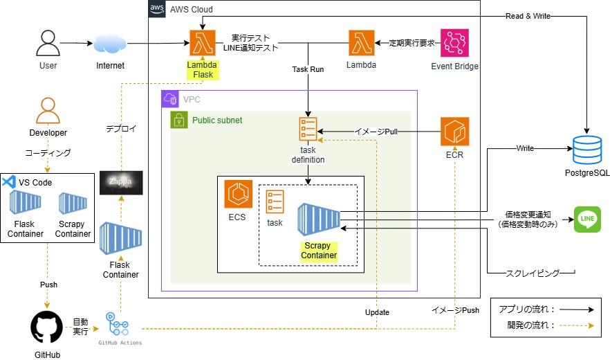

# Dell 製品価格スクレイピングシステム

## 目次
- [構築したWEBアプリ](#構築したWEBアプリ)
- [概要](#概要)
- [主な機能](#主な機能)
- [システム構成とモジュール構成](#システム構成とモジュール構成)
- [使用技術](#使用技術)
- [処理フロー](#処理フロー)
- [ローカル開発環境の構築](#ローカル開発環境の構築)
- [AWS環境構築](#aws環境構築)
- [デプロイ手順 (AWS)](#デプロイ手順-aws)
- [ライセンス](#ライセンス)

## 構築したWEBアプリ
本システムでは、Dell製品の価格変動を確認したり、スクレイピングの実行状況を管理するためのWebインターフェースを提供しています。

### アクセス方法
- **本番環境**: [Dell価格チェッカー](https://u49w2optbh.execute-api.ap-northeast-1.amazonaws.com/dev)
- **開発環境**: http://localhost:5000 (ローカル開発環境構築後)

### スクリーンショット


## 概要
本システムは、Dell 製品の価格を定期的にスクレイピングし、価格変動を検知すると LINE に通知を送る AWS ベースのスクレイピングシステムです。

## 主な機能
- **価格データのスクレイピング**  
  - Scrapy+playwright を使用して Dell の商品情報と価格を取得し、データベースに格納。

- **価格変動通知**  
  - 過去データと比較し、価格が変動した場合に LINE へ通知を送信。

- **AWS ECS (Fargate) を使用したスクレイピングタスクの実行**  
  - **定期的な実行**: AWS EventBridge を利用して 1 日 1 回タスクを起動。  
  - **手動実行**: Lambda を通じて API 経由で任意のタイミングでスクレイピングを実行可能。  

- **ECR によるコンテナ管理**  
  - Scrapy コンテナのイメージを ECR に保存し、ECS で利用。

- **PostgreSQL へのデータ保存**  
  - 価格履歴を Render.com 上の PostgreSQL に格納。

- **GitHub Actions を利用した CI/CD パイプライン**  
  - コードの変更を検知し、ECS 用のコンテナを自動ビルド＆デプロイ。

## システム構成とモジュール構成

### システム構成図


### モジュール構成
```
DELL_PRICE_CHECK
├── api
│   ├── model
│   ├── routes
│   ├── static
│   │   ├── css
│   │   ├── js
│   │   └── templates
│   └app.py
└── scrapers
    ├── dell
    │   ├── spiders
    ├── model
    ├── notification
    ├── app.py
    └── scrapy.cfg
```
#### 主要ディレクトリの説明

- **api**: WebアプリケーションとバックエンドAPIを管理
  - **model**: データモデルの定義
  - **routes**: APIエンドポイントとルーティング設定
  - **static**: フロントエンド用の静的ファイル（CSS, JavaScript, HTMLテンプレート）

- **scrapers**: Dellの製品価格をスクレイピングするモジュール
  - **dell**: Scrapy用のスパイダーと関連設定
  - **model**: スクレイピングデータのモデル定義
  - **notification**: LINE通知機能の実装

このように機能ごとに分離された構成により、APIサーバーとスクレイピングシステムを独立して開発・デプロイすることが可能です。両システムはデータベースを介して連携しています。

## 使用技術

### プログラム
- **Python 3.11**: システム全体の実装  
- **Scrapy + Playwright**: JavaScript をレンダリングしながら価格情報を取得  
- **Flask**: 外部 API を提供し、スクレイピングをトリガー 
- **LINE Messaging API**: 価格変動時の通知  
- **Chart.js**: 価格推移グラフの描画

### クラウド環境 (AWS)
- **AWS ECS (Fargate)**: スクレイピングコンテナの実行環境  
- **AWS EventBridge**: 定期実行スケジュール管理  
- **AWS Lambda**: 手動実行や LINE 通知用  
- **Amazon RDS (PostgreSQL)**: 価格データの保存  
- **Amazon ECR**: コンテナイメージの保存  

### 開発・デプロイ
- **Docker**: コンテナ化  
- **GitHub Actions**: CI/CD パイプライン  
- **Zappa**: Flask アプリのデプロイ管理  

## 処理フロー
1. **定期実行 (EventBridge) または 手動実行 (Lambda, Flask API)** により ECS タスクを起動
2. **ECS Fargate 上の Scrapy コンテナが Web サイトから価格情報を取得**
3. **取得したデータを PostgreSQL に保存し、前回価格と比較**
4. **価格変動があれば LINE へ通知**
5. **スクレイピング結果をログに記録**


## ローカル開発環境の構築

### 1. リポジトリをクローン
```sh
git clone https://github.com/junpatch/dell_price_check_docker
cd dell_price_check_docker
```

### 2. 環境変数ファイルの設定
`.env` ファイルを作成し、以下の変数を設定してください。

`api/.env`
```ini
POSTGRE_USER_NAME=xxxxx
POSTGRE_PASSWORD=xxxxx
POSTGRE_HOST_NAME=xxxxx
POSTGRE_DB_NAME=xxxxx
```
`scrapers/.env`
```ini
LINE_ACCESS_TOKEN=xxxxx
POSTGRE_USER_NAME=xxxxx
POSTGRE_PASSWORD=xxxxx
POSTGRE_HOST_NAME=xxxxx
POSTGRE_DB_NAME=xxxxx
```

### 3. Docker コンテナのビルド＆起動
以下のコマンドを実行し、Flask API と Scrapy コンテナを起動。

```sh
docker-compose up --build -d
```
### 4. Flask サーバーの起動
Flaskのコンテナに入り、Flaskを実行します。
```sh
docker exec -it flask_container bash
flask run --host=0.0.0.0
```

### 5. Web サイトの起動確認
ブラウザで http://localhost:5000 にアクセスし、以下の機能を確認してください。

- **スクレイピングの手動実行、LINE通知テスト**
- **LINE通知の ON / OFF 設定**
- **過去の価格推移グラフの表示**

または、API の動作確認をする場合は curl コマンドを実行。
```sh
curl http://localhost:5000
```
### 6. コンテナの停止
開発を終了するときは以下のコマンドでコンテナを停止。

```sh
docker-compose down
```

## AWS環境構築

### 1. ECSクラスターの作成
AWSコンソールからECSクラスターを作成します。
- クラスター名: `scraping-ecs-cluster`
- キャパシティプロバイダー: Fargate Spot（コスト最適化のため）

参考: [Amazon ECS クラスターの作成](https://docs.aws.amazon.com/ja_jp/AmazonECS/latest/developerguide/create-cluster.html)

### 2. タスク定義の作成
スクレイピング用のタスク定義を作成します。
- ファミリー名: `scraper-ecs-task`
- 互換性: FARGATE
- タスクロール: スクレイピングに必要な権限を持つIAMロール
- タスク実行ロール: ECSタスク実行に必要な権限を持つIAMロール
- コンテナ定義（GitHub Actionsから更新するのでダミー）:
  - イメージ: ECRリポジトリのスクレイピングコンテナイメージURI
  - メモリ: 0.5GB
  - CPU: 0.25vCPU
  - 環境変数: LINE_ACCESS_TOKEN, POSTGRE_USER_NAME, POSTGRE_PASSWORD, POSTGRE_HOST_NAME, POSTGRE_DB_NAME

参考: [Amazon ECS タスク定義の作成](https://docs.aws.amazon.com/ja_jp/AmazonECS/latest/developerguide/create-task-definition.html)

### 3. VPC構築
スクレイピングタスクを実行するためのネットワーク環境を構築します。
- 適切なサブネットとセキュリティグループを設定
- パブリックサブネット（インターネットアクセス用）
- セキュリティグループ: アウトバウンドトラフィックを許可

参考: [Amazon VPC の作成](https://docs.aws.amazon.com/ja_jp/vpc/latest/userguide/vpc-getting-started.html)

### 4. Lambda関数の作成
ECSタスクを起動するためのLambda関数を構築します。
- ランタイム: Python 3.11
- タイムアウト: 3秒
- IAMロール: ECSタスク実行と CloudWatch Logs 書き込み権限
- 以下のコードを使用:

```python
import json
import boto3
import datetime


CLUSTER_NAME = "scraping-ecs-cluster"
TASK_FAMILY = "scraper-ecs-task"
SUBNETS = ["subnet-0aeb6f09a8223f928", "subnet-08ababb4f6a70f6c1"]
SECURITY_GROUPS =["sg-049f994ecd0660ac2"]

ecs_client = boto3.client("ecs", region_name="ap-northeast-1") 

def lambda_handler(event, context):

    client = boto3.client("ecs")    

    response = ecs_client.run_task(
        cluster=CLUSTER_NAME,
        taskDefinition=get_latest_task_definition(TASK_FAMILY),
        capacityProviderStrategy=[
            {"capacityProvider": "FARGATE_SPOT", "weight": 1}
        ],
        networkConfiguration={
            "awsvpcConfiguration": {
                "subnets": SUBNETS,
                "securityGroups": SECURITY_GROUPS,
                "assignPublicIp": "ENABLED",
            }
        },
        startedBy="lambda-EventBridge-trigger"
    )
    
     # datetime型のオブジェクトを文字列に変換するカスタムシリアライザを定義
    def custom_serializer(obj):
        if isinstance(obj, datetime.datetime):  # datetime.datetime を明示的に指定
            return obj.isoformat()  # datetime を ISO 8601 形式で文字列に変換
        raise TypeError("Type not serializable")

    formatted_response = json.dumps(response, default=custom_serializer)

    return {
        'statusCode': 200,
        'body': formatted_response  # 整形したresponseを返す
    }

def get_latest_task_definition(task_family):
    """タスク定義の最新リビジョンを取得"""
    response = ecs_client.list_task_definitions(
        familyPrefix=task_family,
        sort="DESC",
        status="ACTIVE",
        maxResults=1
    )
    if response["taskDefinitionArns"]:
        return response["taskDefinitionArns"][0]  # 最新のリビジョン ARN を取得
    else:
        raise ValueError("No active task definition found.")
```

参考: [AWS Lambda 関数の作成](https://docs.aws.amazon.com/ja_jp/lambda/latest/dg/getting-started.html)

## 5. EventBridge ルールの設定
Lambda関数を定期的に実行するためのイベントルールを作成します。
- ルール名: `daily-scraping-trigger`
- スケジュール式: `cron(0 0 * * ? *)`  # 毎日0時（UTC）に実行
- ターゲット: 作成したLambda関数

参考: [Amazon EventBridge ルールの作成](https://docs.aws.amazon.com/ja_jp/eventbridge/latest/userguide/eb-create-rule.html)

## 6. IAMロールの設定
以下のサービスに必要なIAMロールを作成してください。
- Lambda実行ロール（ECSタスク起動権限付き）
- ECSタスク実行ロール
- ECSタスクロール（PostgreSQL接続、LINE API呼び出し権限）

参考: [IAM ロールの作成](https://docs.aws.amazon.com/ja_jp/IAM/latest/UserGuide/id_roles_create.html)

## 7. リソース間の連携確認
- Lambda -> ECS タスク起動
- ECS タスク -> PostgreSQL 接続
- ECS タスク -> LINE API 呼び出し

各リソースのログを確認して、正常に連携できているか確認してください。

## デプロイ手順 (AWS)
本システムのデプロイは、GitHub Actionsによる自動デプロイと、コマンドラインからの手動デプロイの両方をサポートしています。

### GitHub Actionsによる自動デプロイ

#### 1. GitHub Actions の認証情報設定
GitHub リポジトリの Settings > Secrets and variables > Actions で以下の環境変数を設定してください：

- `AWS_ACCESS_KEY_ID`: AWSアクセスキーID
- `AWS_SECRET_ACCESS_KEY`: AWSシークレットアクセスキー
- `LINE_ACCESS_TOKEN`: LINE Messaging API のアクセストークン

### 2. デプロイの実行
変更を`main`ブランチにPushするだけで、GitHub Actionsが自動的に以下を実行します：

- Scrapyコンテナのビルドとプッシュ
- ECSタスク定義の更新
- Flaskアプリケーションの更新

GitHub Actionsの実行状況はリポジトリの「Actions」タブで確認できます。


## コマンドラインからの手動デプロイ

手動でデプロイを行う場合は、以下の手順に従ってください。

### 1. AWS CLIの設定
AWS CLIがインストールされていることを確認し、認証情報を設定します。

```sh
aws configure
# AWS Access Key IDとSecret Access Key、リージョンを入力
```

### 2. Flask API (Zappa) のデプロイ

#### 初回デプロイ
```sh
cd api
pip install -r requirements.txt
zappa deploy
```

#### 更新デプロイ
```sh
cd api
zappa update
```

#### デプロイ状態の確認
```sh
zappa status
```

### 3. Scrapyコンテナの手動デプロイ

#### Dockerイメージのビルド
```sh
cd scrapers
docker buildx build --platform linux/amd64 --provenance=false -t dell-price-scraper:latest .
```

#### ECRリポジトリへのプッシュ
```sh
# ECRへのログイン
aws ecr get-login-password --region ap-northeast-1 | docker login --username AWS --password-stdin <your-aws-account-id>.dkr.ecr.ap-northeast-1.amazonaws.com

# イメージのタグ付け
docker tag dell-price-scraper:latest <your-aws-account-id>.dkr.ecr.ap-northeast-1.amazonaws.com/dell-price-scraper:latest

# イメージのプッシュ
docker push <your-aws-account-id>.dkr.ecr.ap-northeast-1.amazonaws.com/dell-price-scraper:latest
```

#### ECSタスク定義の更新
```sh
# 既存のタスク定義を取得し、コンテナイメージを更新
aws ecs describe-task-definition --task-definition scraper-ecs-task > task-definition.json
# JSONファイルを編集してイメージURIを更新

# 更新したタスク定義を登録
aws ecs register-task-definition --cli-input-json file://task-definition.json
```

#### タスクの手動実行（オプション）
```sh
aws ecs run-task \
  --cluster scraping-ecs-cluster \
  --task-definition scraper-ecs-task \
  --capacity-provider-strategy '[{"capacityProvider": "FARGATE_SPOT", "weight": 1}]' \
  --network-configuration "awsvpcConfiguration={subnets=[subnet-xxxxx],securityGroups=[sg-xxxxx],assignPublicIp=ENABLED}"

```

## ライセンス
MIT License

